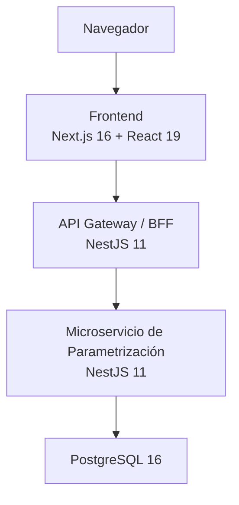

# Serviplus Parametrización

Módulo de **parametrización** para la plataforma **Serviplus S.A.**, enfocado en autenticación, gestión de clientes, servicios y usuarios, implementado con arquitectura de microservicios, **API Gateway/BFF**, documentación Swagger y persistencia en **PostgreSQL**.

> **Verificado en el código:** este proyecto **no usa Firebase** ni Firestore. La persistencia actual está implementada con **PostgreSQL + TypeORM**.

[]()
[]()
[]()
[]()
[]()
[]()

## Descripción

**Serviplus Parametrización** centraliza reglas y catálogos base del sistema. Según el código actual del repositorio, este módulo cubre principalmente:

- **Autenticación con JWT**
- **Menú por rol** para usuarios autenticados
- **Gestión de clientes**
- **Gestión de servicios**
- **Gestión de usuarios**
- **Documentación de API con Swagger**
- **Health checks** para gateway y microservicio

Roles identificados en el código:

- **Admin**
- **Coord**
- **Consultor**

## Arquitectura

La solución está organizada como un monorepo con **frontend**, **API Gateway** y **microservicio de parametrización**.



### Patrones y decisiones visibles en el repositorio

- **BFF / API Gateway** para desacoplar frontend y backend.
- **Registro dinámico de servicios** en el gateway mediante variables `SERVICES_*`.
- **Arquitectura por capas** en el microservicio:
  - `application`
  - `domain`
  - `infrastructure`
  - `presentation`
  - `transversal`
- **JWT + guards + roles** para autorización.
- **Swagger** para documentación técnica.
- **Rate limiting** en gateway.
- **Circuit breaker / timeout handling** en gateway.

## Stack tecnológico

### Frontend (`frontend`)

| Capa | Tecnología |
| --- | --- |
| Framework | Next.js 16 (App Router) |
| UI | React 19 |
| Estilos | Tailwind CSS 4 |
| Lenguaje | TypeScript 5 |
| Cliente HTTP | Axios |
| Calidad | ESLint |

### API Gateway (`api-gateway`)

| Capa | Tecnología |
| --- | --- |
| Framework API | NestJS 11 |
| Lenguaje | TypeScript 5 |
| Proxy | `http-proxy-middleware` |
| Cliente HTTP | Axios |
| Seguridad | JWT, rate limiting, circuit breaker |
| Tests | Jest |

### Microservicio (`microservice-parametrizacion`)

| Capa | Tecnología |
| --- | --- |
| Framework API | NestJS 11 |
| Lenguaje | TypeScript 5 |
| ORM | TypeORM |
| Base de datos | PostgreSQL |
| Auth | Passport JWT + bcrypt |
| Documentación | Swagger |
| Validación | `class-validator` + `class-transformer` |
| Tests | Jest |

### Infraestructura

| Componente | Tecnología |
| --- | --- |
| Orquestación local | Docker Compose |
| Base de datos | PostgreSQL 16.3 Alpine |
| CI | GitHub Actions |
| Análisis estático | SonarCloud (microservicio) + CodeQL |
| CD | Docker Hub + despliegue a EC2 |

## Requisitos previos

- Docker 24 o superior
- Docker Compose 2.20 o superior
- Node.js 20+ recomendado para desarrollo local
- npm
- Git

## Inicio rápido

### 1. Clonar el repositorio

```bash
git clone <URL_DEL_REPOSITORIO>
cd Serviplus-parametrizacion
```

### 2. Configurar variables de entorno

Creá un archivo `.env` en la raíz del proyecto:

```env
DB_USER=postgres
DB_PASSWORD=postgres
DB_NAME=serviplus_parametrizacion
JWT_SECRET=super_secret_key
```

### 3. Levantar el stack local

```bash
docker compose up --build
```

### 4. Verificar que los servicios estén activos

Accesos esperados por defecto:

| Servicio | URL |
| --- | --- |
| Frontend | `http://localhost:3002` |
| API Gateway / BFF | `http://localhost:3000` |
| Microservicio | `http://localhost:3001` |
| PostgreSQL | `localhost:5432` |

## Variables de entorno

### Variables raíz usadas por `docker-compose.yml`

- `DB_USER`
- `DB_PASSWORD`
- `DB_NAME`
- `JWT_SECRET`

### Variables detectadas en el API Gateway

- `PORT`
- `JWT_SECRET`
- `RATE_LIMIT_WINDOW_MS`
- `RATE_LIMIT_MAX_REQUESTS`
- `SERVICES_PARAMETRIZACION_URL`
- `SERVICES_PARAMETRIZACION_AUTH`
- `SERVICES_AUTH_URL`
- `SERVICES_AUTH_AUTH`
- `SERVICES_DOCS_URL`
- `SERVICES_DOCS_AUTH`

### Variables detectadas en el microservicio

- `PORT`
- `DB_HOST`
- `DB_PORT`
- `DB_USER`
- `DB_PASSWORD`
- `DB_NAME`

### Variables detectadas en el frontend

- `NEXT_PUBLIC_BFF_URL`

> Además, `docker-compose.prod.yml` usa `DOCKER_USERNAME` e `IMAGE_TAG` para resolver las imágenes publicadas en Docker Hub.

## Endpoints principales

### API Gateway

- `GET /health`
- `GET /health/services`
- Proxy dinámico para rutas `/api/...`

### Microservicio de parametrización

#### Autenticación
- `POST /api/v1/auth/login`
- `GET /api/v1/auth/me/menu`

#### Clientes
- `POST /api/v1/clients`
- `GET /api/v1/clients`
- `PATCH /api/v1/clients/:id/status`

#### Servicios
- `POST /api/v1/servicios`
- `GET /api/v1/servicios`
- `PUT /api/v1/servicios/:id`

#### Usuarios
- `POST /api/v1/usuarios`
- `GET /api/v1/usuarios`
- `PUT /api/v1/usuarios/:id`

## Documentación y observabilidad

| Recurso | URL |
| --- | --- |
| Health Gateway | `http://localhost:3000/health` |
| Health Gateway Services | `http://localhost:3000/health/services` |
| Health Microservicio | `http://localhost:3001/health` |
| Swagger Microservicio | `http://localhost:3001/api/docs` |
| Swagger vía Gateway | `http://localhost:3000/api/docs` |

## Ejecución por servicio

### Frontend

```bash
cd frontend
npm install
npm run dev
```

### API Gateway

```bash
cd api-gateway
npm install
npm run start:dev
```

### Microservicio de parametrización

```bash
cd microservice-parametrizacion
npm install
npm run start:dev
```

## Comandos útiles

### API Gateway

```bash
cd api-gateway
npm ci
npm run typecheck
npm run lint
npm run test
npm run test:cov
```

### Frontend

```bash
cd frontend
npm ci
npm run typecheck
npm run lint
```

### Microservicio

```bash
cd microservice-parametrizacion
npm ci
npm run typecheck
npm run lint
npm run test
npm run test:cov
npm run test:e2e
```

## Estructura del repositorio

```text
.
├── .github/
│   └── workflows/                    # CI/CD, CodeQL y reglas de PR
├── api-gateway/                      # BFF / API Gateway en NestJS
│   ├── src/
│   │   ├── auth/
│   │   ├── common/
│   │   ├── config/
│   │   ├── health/
│   │   └── proxy/
├── frontend/                         # UI en Next.js
│   └── src/
│       ├── app/
│       ├── components/
│       └── services/
├── microservice-parametrizacion/     # Microservicio principal
│   ├── src/
│   │   ├── application/
│   │   ├── auth/
│   │   ├── domain/
│   │   ├── infrastructure/
│   │   ├── presentation/
│   │   └── transversal/
├── docker-compose.yml                # Desarrollo local
├── docker-compose.prod.yml           # Despliegue backend en producción
└── README.md
```

## Flujo de trabajo (Git)

### Reglas detectadas en workflows

| Evento | Workflow | Qué valida / ejecuta |
| --- | --- | --- |
| PR a `develop` con cambios en `api-gateway/**` | `ci-api-gateway.yml` | `npm ci`, typecheck, lint, tests con cobertura, build Docker |
| PR a `develop` con cambios en `frontend/**` | `ci-frontend.yml` | `npm ci`, typecheck, lint |
| PR a `develop` con cambios en `microservice-parametrizacion/**` | `ci-microservice.yml` | `npm ci`, typecheck, lint, tests con cobertura, SonarCloud, build Docker |
| Push a `main` | `cd-deploy.yml` | build/push de imágenes + deploy backend a EC2 |
| PR a `main` | `enforce-pr-to-main.yml` | bloquea PRs a `main` si no vienen desde `develop` |
| Push/PR a `main` o `develop` + cron | `codeql.yml` | análisis de seguridad CodeQL |

### Resumen del flujo recomendado

1. Trabajar sobre una rama de feature.
2. Abrir PR hacia `develop`.
3. Esperar CI por componente afectado.
4. Merge a `develop`.
5. Abrir PR desde `develop` hacia `main`.
6. Al llegar a `main`, se dispara el flujo de CD.

## CI/CD en GitHub

### CI

Actualmente el repositorio tiene pipelines separados por componente:

- **CI API Gateway**
- **CI Frontend**
- **CI Microservice**

Esto reduce trabajo innecesario porque cada workflow se dispara por `paths` sobre su propia carpeta.

### CD

El flujo `cd-deploy.yml` actualmente hace lo siguiente:

- construye imágenes Docker de:
  - `api-gateway`
  - `microservice-parametrizacion`
- publica imágenes en Docker Hub
- despliega backend a **AWS EC2** usando `docker-compose.prod.yml`

> Hay una sección comentada/preparada para despliegue de frontend en **Vercel**, pero hoy no está activa en el workflow.

## Cobertura y calidad

| Componente | Herramienta | Estado verificado |
| --- | --- | --- |
| API Gateway | Jest + ESLint + TypeScript | Sí |
| Frontend | ESLint + TypeScript | Sí |
| Microservicio | Jest + ESLint + TypeScript + SonarCloud | Sí |
| Seguridad repositorio | CodeQL | Sí |

> En `api-gateway` y `microservice-parametrizacion` existe `coverageThreshold` global del 80% en branches, functions, lines y statements dentro de la configuración de Jest.

## Estado actual del proyecto

| Área | Estado | Notas |
| --- | --- | --- |
| API Gateway / BFF | ✅ | Proxy, health, rate limiting y circuit breaker presentes |
| Autenticación JWT | ✅ | Login y guardas implementadas |
| Gestión de clientes | ✅ | Crear, listar y cambiar estado |
| Gestión de servicios | ✅ | Crear, listar y actualizar |
| Gestión de usuarios | ✅ | Crear, listar y actualizar |
| Swagger | ✅ | Disponible en microservicio |
| Frontend base | ✅ | Home, ruta `/servicios`, formulario y cliente Axios |
| Despliegue backend | ✅ | Docker Hub + EC2 |
| Despliegue frontend automatizado | 🟡 | Bloque Vercel preparado pero comentado |

## Integrantes

> Pendiente por completar con los integrantes actuales del grupo.

## Créditos

Proyecto académico / Serviplus S.A. — módulo de parametrización.

## Licencia

Código privado — `UNLICENSED`.
